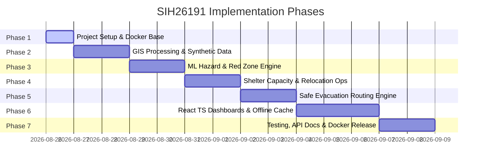

# Implementation Plan — SIH26191: Intelligent Disaster Management Platform

## Executive Summary
This document outlines the multi-phase implementation roadmap for building the **Intelligent Hazard-Based Red Zone Mapping, Carrying Capacity Assessment & Relocation System** (SIH26191). The platform combines GIS, Machine Learning, real-time shelter capacity tracking, dynamic safe evacuation routing, and an interactive dashboard.

---

## Phase Roadmap

---

## Detailed Phase Breakdown

### Phase 1: Project Setup & Baseline Infrastructure
- **Deliverables**:
  - Directory skeleton setup (`frontend/`, `backend/`, `ml/`, `gis/`, `data/`, `database/`, `scripts/`, `tests/`, `docs/`, `docker/`).
  - `.env.example` configuration template.
  - `docker-compose.yml` configured for PostgreSQL 16 + PostGIS 3.4 and FastAPI backend.
  - Initial configuration files (`pyproject.toml` / `requirements.txt`, `package.json`).
- **Verification**: `docker compose config` validation and container boot test.

### Phase 2: Synthetic Datasets & GIS Core Engine (`gis/` & `data/`)
- **Deliverables**:
  - Script (`scripts/generate_demo_data.py`) to generate synthetic DEM (Digital Elevation Model), rainfall rasters, road network GeoJSON, and shelter points.
  - GIS processing module (`gis/raster_processor.py`) for calculating slope, aspect, and elevation profiles.
  - Vector spatial processing module (`gis/vector_processor.py`) using GeoPandas & Shapely.
- **Verification**: Unit tests in `tests/test_gis.py` verifying spatial rasters and vector calculations.

### Phase 3: ML Hazard Risk & Red Zone Mapping Engine (`ml/`)
- **Deliverables**:
  - ML training script (`ml/train_hazard_model.py`) using synthetic topographical & rainfall features with XGBoost / scikit-learn.
  - Hazard prediction service (`ml/risk_predictor.py`) generating spatial risk grids.
  - Red Zone Delineator (`gis/red_zone.py`) vectorizing risk grids into Red, Yellow, and Green zone polygons.
- **Verification**: ML unit test suite (`tests/test_ml.py`) checking prediction accuracy, schema validation, and spatial polygon creation.

### Phase 4: Shelter Carrying Capacity & Relocation Optimization (`backend/` & `ml/`)
- **Deliverables**:
  - Database schema & SQLAlchemy models for shelters, capacity metrics, resources (water/food days).
  - Relocation allocation algorithm (`backend/app/services/relocation.py`) mapping displaced populations from Red Zones to optimal safe shelters without exceeding capacity limits.
- **Verification**: Test suite (`tests/test_relocation.py`) verifying capacity constraints, zero-over-allocation guarantees, and shortest-distance optimization.

### Phase 5: Dynamic Safe Evacuation Routing Engine (`gis/` & `backend/`)
- **Deliverables**:
  - NetworkX graph parser for road networks (`gis/routing.py`).
  - Red Zone risk-aware cost weighting algorithm (inflating edge weights or removing edges intersecting Red Zones).
  - Dijkstra / A* route calculation API service delivering safe path GeoJSON.
- **Verification**: Test suite (`tests/test_routing.py`) ensuring routes systematically avoid designated Red Zones.

### Phase 6: Frontend Dashboards & Offline Features (`frontend/`)
- **Deliverables**:
  - React + TypeScript SPA built with Vite.
  - Admin Dashboard: Interactive GIS map view, hazard layer toggle, shelter capacity management, ML trigger interface.
  - Public Evacuation Dashboard: Safe route request interface, nearest shelter finder, mobile-optimized view.
  - PWA Service Worker caching tile metadata, emergency offline routes, and contacts.
- **Verification**: Frontend component tests (`frontend/src/__tests__`) and end-to-end user flow verification.

### Phase 7: Automated Testing, Documentation & Docker Polish
- **Deliverables**:
  - Comprehensive unit and integration test execution (`pytest`).
  - OpenAPI / FastAPI interactive documentation at `/docs`.
  - Beginner-friendly step-by-step `README.md` guide.
  - Multi-container Docker Compose build verification.
- **Verification**: Full test suite run passing with 100% core test success and zero critical lint/type errors.
